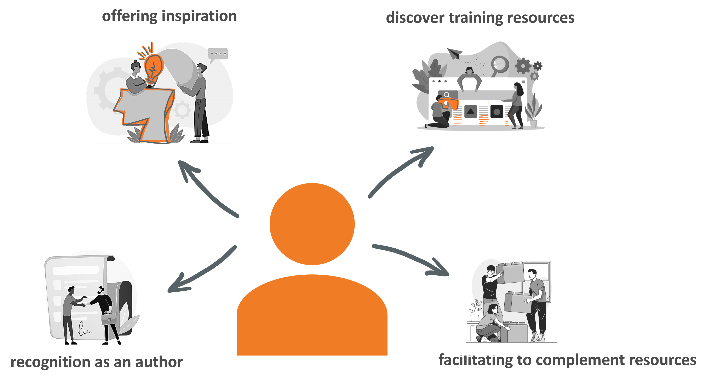

# Protocols for efficient use of TeSS

Hello and welcome, this is our interactive hands-on course about efficient use of the ELIXIR TeSS platform.

To prepare this training material, we have reused the content of the publication 'Making Bioinformatics Training Events and Material More Discoverable Using TeSS, the ELIXIR Training Portal' published in Current Protocols in Bioinformatics. The original publication of the protocols can be found [here](https://doi.org/10.1002/cpz1.682). 

*About ELIXIR Training Platform*

The ELIXIR Training Platform was established to develop a training community that spans all ELIXIR member states (see the list of Training Coordinators). It aims to strengthen national training programmes, grow bioinformatics training capacity and competence across Europe, and empower researchers to use ELIXIR's services and tools. 

One service offered by the Training Platform is TeSS, the training registry for the ELIXIR community. Together with ELIXIR France and ELIXIR Slovenia, VIB as lead node for ELIXIR Belgium is engaged in consolidating quality and impact of the TeSS training resources (2022-23) (https://elixir-europe.org/internal-projects/commissioned-services/2022-trp3).

The Training eSupport System was developed to help trainees, trainers and their institutions to have a one-stop shop where they can share and find information about training and events, including training material. This way we can create a catalogue that can be shared within the community. How it works is what we are going to find out in this course.

License: {: style="width:1in;"}

## Introduction

Many trainers and their organisations are passionate about sharing their training material. Sharing training material has several benefits like providing a record of recognition as an author, offering inspiration to other trainers, enabling researchers to discover training resources for their personal learning path, and facilitating to complement the training resource landscape by data-driven gap analysis from the bioinformatics community (see [PLOS Computational Biology, 16(5), e1007854](https://doi.org/10.1371/journal.pcbi.1007854)).

In this tutorial, we elaborate a series of protocols leading the TeSS users through the process of searching and filtering TeSS content (Scenario 1 to 3). Scenario 4 to 7 show how to register manually and automatically training events and material in the [Training eSupport System (TeSS), ELIXIR’s training portal](https://tess.elixir-europe.org). More information about TeSS can be found in [this publication](https://doi.org/10.1093/bioinformatics/btaa047). 

TeSS provides a one-stop shop for trainers and trainees to discover online information and content, including training materials, events and interactive tutorials. Following these protocols, you will contribute to promote your training events and add to a growing catalog of materials. This will concomitantly increase the FAIRness of training materials and events.

Training registries like TeSS use a scraping mechanism to aggregate training resources from many providers when they have been annotated using training specific [BioSchemas specifications](https://doi.org/10.1101/2022.11.24.516513). Protocol 8 will teach you how to enrich your training resources to allow for more efficient sharing of the structured metadata like prerequisites, target audience, and learning outcomes using Bioschemas specification. Once more and more training events and material are aggregated in TeSS, searching the registry for specific events and material becomes crucial.

.

## More background information about TeSS

During the ELIXIR-EXCELERATE project, the TeSS platform has been established as the key application for bioinformatics training events and material aggregation. During a period of further adoption of the TeSS platform as such on the international level e.g. in Australia and in the Netherlands, it became obvious that the implementation of individual automatic content scrapers for more than 30 content providers lead to an enormous diversity of the code base and finally to a maintenance challenge. Therefore, during the last two to three years, a strategic reorientation of the automated harvesting procedure has been proposed and implemented in TeSS using the Bioschemas profiles for Course, CourseInstance and TrainingMaterial. This approach will put the content providers in a more prominent position since they are in turn responsible for a more structured delivery of more comprehensive metadata of their training events and material to TeSS as the aggregation platform. In the longer run, this will increase the quality level of the aggregated resources and its usefulness to TeSS user base.

`TODO: Would be insteresting to add a box explaining the specificity of each?`

Content providers looking to promote use of particular tools and databases via their course offering or the specific training material can find information about them in other ELIXIR registries, such as [bio.tools](https://bio.tools) for tools and web services  and [FAIRsharing.org](https://fairsharing.org) for databases, standards and policies . Lately, such registries started to track training relating to the resources they list. Therefore, it is mutually beneficial that TeSS provides the relevant links, allowing users to search for resource-specific training; and the resource pages in bio.tools and FAIRsharing that contain reciprocal links for users to discover relevant training in TeSS.

`TODO: Are TeSS, BioTools and FAIRsharing connected? In content?`

Related to the provisioning of persistent identifiers, TeSS provides the Digital Object Identifier (DOI) as a unique means to identify training material. Given that minting services by e.g. university libraries are not yet broadly available for teaching and learning material in contrast to research datasets and collections, associated workflows, software and models, we recommend to use services like OSF or zenodo to get own unique, persistent URLs and DOIs.

Given the engagement of the ELIXIR Train the Trainer instructor's community to create a vibrant environment for reciprocal support and exchange of experiences via the ELIXIR Train the Trainer programme, the TeSS content providers are encouraged to  follow best-practice guidance on course and training material development (Via et al., 2020). Therefore, we recommend applying the Bloom hierarchy of cognitive skills to formulate the Learning objectives for the courses as well as for training material. For more detailed information about our pedagogical model, please browse to the course material of the [ELIXIR Train the Trainer course](https://github.com/TrainTheTrainer/ELIXIR-EXCELERATE-TtT).

In the next chapter, you can follow all scenarios regarding searching events and material.
