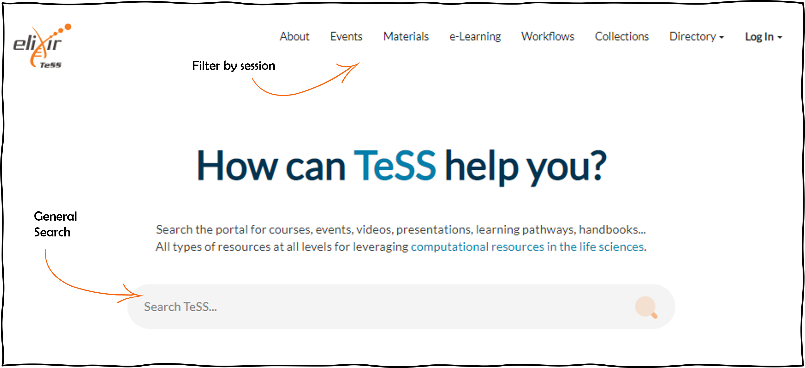
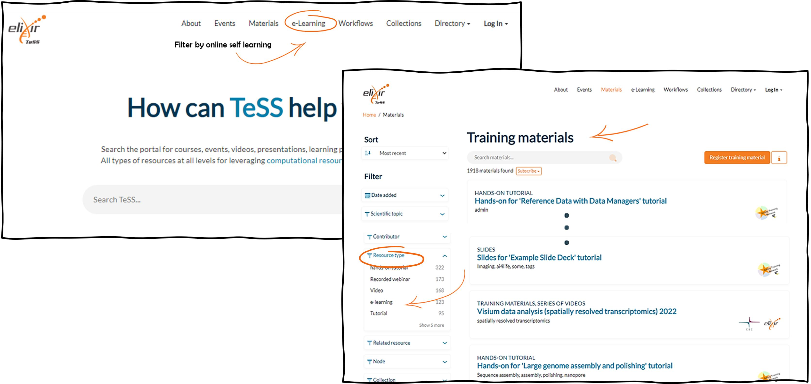

## Scenario 1: Searching for training events in TeSS

Training resources (both events and materials) may be searched in TeSS in several ways. If you are on the main page of TeSS, a general search can be performed based on keywords, which will return separate lists of events and materials. Alternatively, events or materials can be searched for independently of each other. This second approach allows more precise filtering on several parameters (e.g., event type, country, and target audience) alone or in combination.

In this protocol, we provide examples of searches for specific events or materials. Be aware that by searching for events, the standard search returns only future events. If you want to include past events, you need to click the **Show past event** button. 

Please navigate to [TeSS](https://tess.elixir-europe.org) and follow the steps shown below.

1. Select Events in the top menu.
2. **Search for** ‘Single-cell’ as the keyword in the search text box on the right side of the page. **You can click on the magnifier icon or press Enter**.
3. Click on the **Show past events** button **at the bottom of the side menu**. Click on 'Filters' if you do not see this side menu due to your browser being non-fullscreen.
4. On the side menu, scroll down to the Country facet. We will select the United Kingdom.
5. On the side menu, scroll to the facet Target audience. Select ‘Graduate students’.
6. As a result, you get the list of training events about single-cell data analysis available in the United Kingdom for Graduate students.
7. Change the sort filter to 'Latest' in order to see an anti-chronological listing of the events.

At any time you may remove any of the filters you applied to reduce stringency of your search.

Please proceed to the next step to see the results.

At any time you may remove any of the filters you applied to reduce stringency of your search.

In June 2023, we found 13 past events with this search query.  

Have a look at the URL to understand how you could query TeSS via the API.

https://tess.elixir-europe.org/events?country=United+Kingdom&include_expired=true&q=single-cell&target_audience=Graduate+students&sort=late

Let's have a look at the documentation of the API: https://tess.elixir-europe.org/api/json_api#tag/events

Here you see all the query parameters. In our query, we have been using several of these parameters and concatenated them.

1. First, we used the free text query parameter `q` and set it to `single-cell`. 
2. Second, we used the `include_expired` parameter and set it to `true`. 
3. Third, we used the `country[]` parameter and set it to "United+Kingdom". Note that you need to replace the space by a `+` sign. 
4. Fourth, we used the `target_audience[]` parameter and set it to `Graduate+students". 
5. To change the sorting, use the `sort` parameter. You have 5 options, we have used `late` to sort by date, latest to earliest (events only).  

If you would like to get the events from France, too, you'd need to add yet another query with `country[]=France`.

To get the full query, you need to concatenate all the individual queries with an ambersand `&`. 

## Scenario 2: Searching for e-learning materials in TeSS

E-learning resources are a specific type of training materials in TeSS which are displayed on the dedicated section **E-learning** on the main TeSS page. 

But you can also perform a specific search on the Materials page filtering on 'Resource type' and retrieve e-learning material by specifying the value 'e-learning'.

Please navigate to [TeSS](https://tess.elixir-europe.org).

1.	Select Materials in the top menu.

2.	Enter a keyword in the search text box on the right side of the page. We will enter ‘Data retrieval’.

3.	On the side menu, select a difficulty level. We will select ‘Beginner’.

4.	Scroll to the facet ‘Resource type’ and select ‘e-learning’.

5.	You get the list of training materials about data retrieval intended for a beginner level audience whereby the resource has been tagged as e-learning material. At any time you may remove any of the filters you applied to reduce stringency of your search.

!!! example "Search exercises"

    1. Using keywords search - find the training material of VIB: Git & GitHub training
    2. Using the filters find the same material
    3. Using keywords search for the training material of IFB:  Fair data - Module 1
    4. Using the filters find the same material
