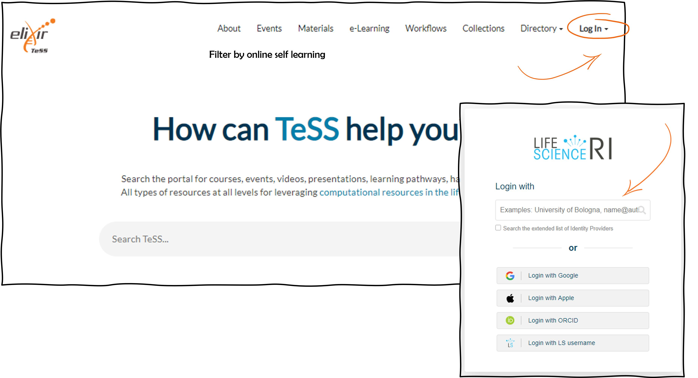
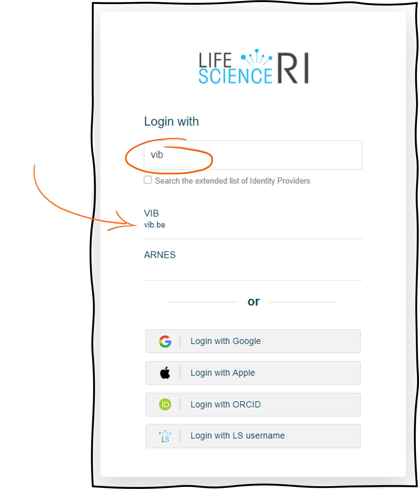
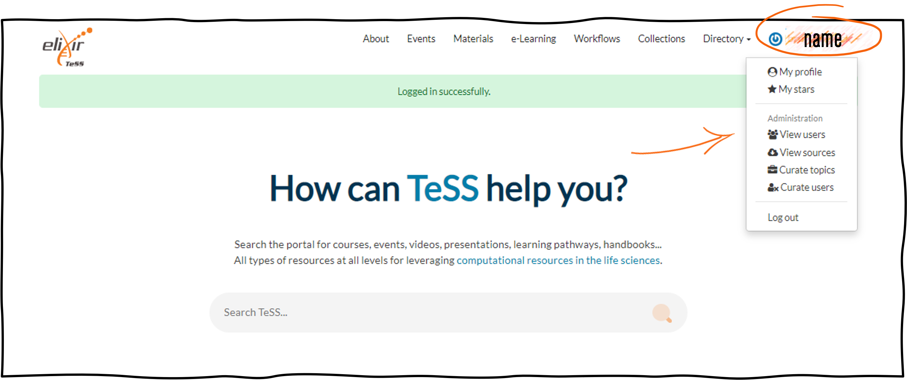
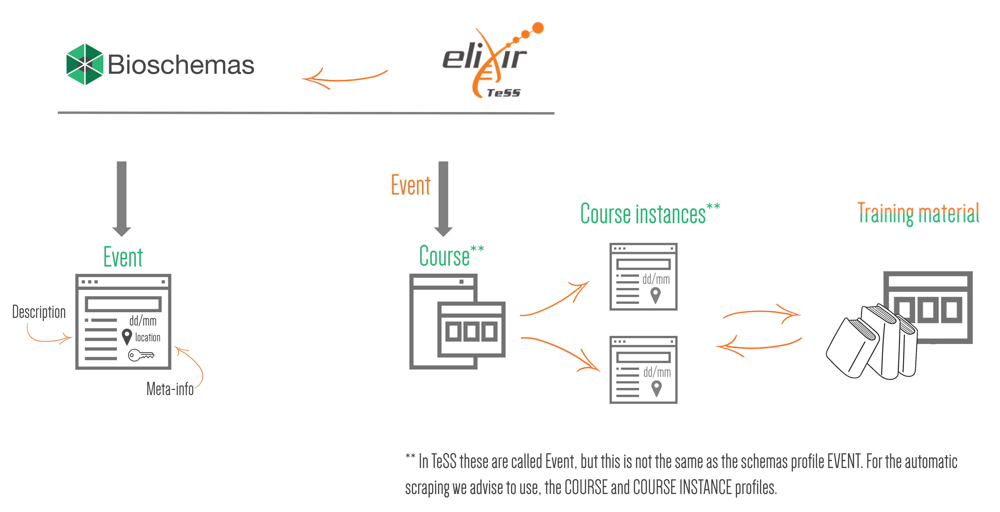
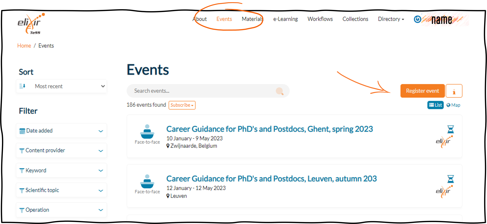
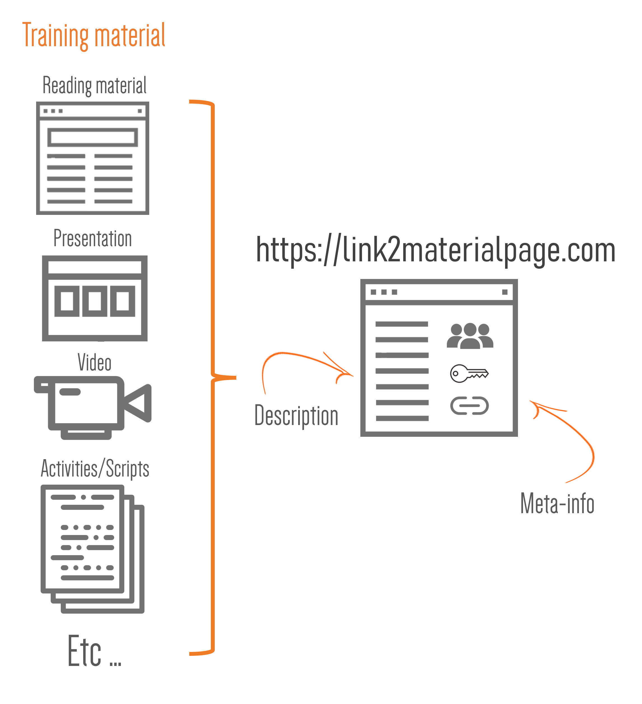
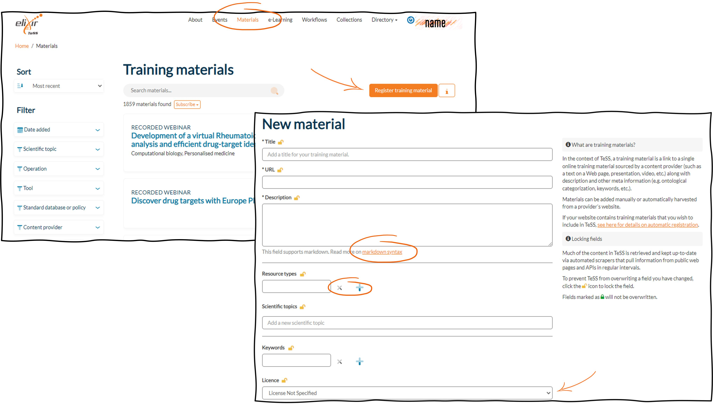
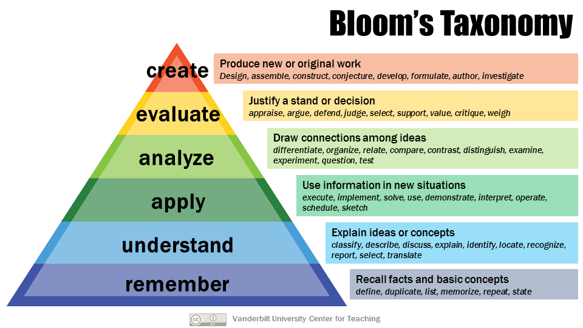
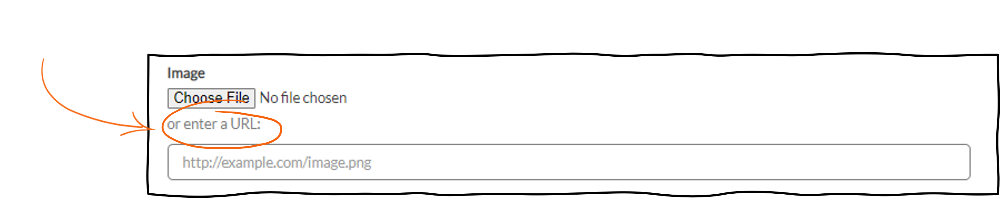

## Scenario 3: Log into TeSS using an institutional account
In order to be able to register resources in TeSS you need to log in the registry. The following steps are specific for the login procedure with the Life Sciences Account. Alternatively, you can use another existing account like Google, Apple or an ORCID. In this case you will be redirected to the respective login portal.

**We will not be able to provide a detail procedure for all the federated authentication mechanisms here. Try the example below.**

*********************

1.	Open your browser and go to [TeSS](https://tess.elixir-europe.org/). 

2.	Click the “Log In” dropdown button on the top-right corner of the page.

3.	To log in using your institutional account, choose Log in with LS Login from the dropdown menu
You will be redirected to the LifeScience RI authentication page (Fig. 1).

4.	Start typing the name of your own institution, for instance ‘VIB’, into the text box then choose the appropriate option that appears and proceed with your usual institutional login procedure (Fig. 2). 

5. You should now be logged into TeSS. Once successful, you should be taken to the TeSS Welcome page with a message stating “Logged in successfully.”  You should also see your username in the top bar of the page, which you can click to view and edit your TeSS profile.

6.	Check all the fields in your user profile are correct and click the “Update Profile” button.
You will also see a button to log out of TeSS.

## Scenario 4: Manual registration of a training event in TeSS

`TODO: move to Scenario 7?`
A training event in TeSS is described by the BioSchemas profile CourseInstance, while the schema.org Event profile is something different. So, let’s start this session pointing out a few differences of each profile:

An unique event such as a congress, symposium, webinar will be classified using the Event profile in Schemas.org, while the Bioschemas Course profile is attached to a unit of teaching that typically lasts one or more academic terms, is led by one or more instructors (teachers or professors), and has a fixed roster of students. A course usually covers an individual subject. Such a course will be linked to several course instances that happen at different moments, locations and might be also subjected to updates and small differences in the material. A course and/or course instance should be linked to a course material, that represents the content of this course/course instance. In TeSS, though, courses and courses instances are in called Event in the interface, while this is not the same as the profile in schemas.org. It works to filter among all courses, webinars, symposia, congresses etc.

Such an event in TeSS is a link to a single training event sourced by a provider along with description and related meta information (e.g. date, location, audience, ontological categorization, keywords, etc.). 

Training events in TeSS can be added manually or automatically harvested from a provider's website. Here is the procedure to register for training events manually.

*********************

1. Login to TeSS at https://tess.elixir-europe.org following [Scenario 3](#6).

2. To register for a training event, click on the Events menu.

3. Click on “+ Register event”. As an example, we use an RNAseq training event.
You will be directed to a form type of page. 

4. Select that Type at the beginning of the form since we enter a face-to-face event.
If your event is online, choosing the option "Online" which will modify the form to fit that type of event i.e. no address field has to be filled in. 

5. In the Title field, enter the Title of the event, which is “Bulk RNASeq: from counts to differential expression” in our example.

6. The optional Subtitle field can be filled in case you’d like to specify more context on the event, like “Spring edition” of a regularly repeated course.

7. In the URL field, enter the URL where the announcement and registration of the training event can be found. In our example: “https://training.vib.be/all-trainings/bulk-rnaseq-counts-differential-expression-2”

8. In the subsequent field Description, provide general information and relevant context about the training event in the form of short text, like in our example: “The course consists of introductory online material on producing count matrices and two face-to-face sessions on differential expression analysis in R and all the questions that arise when trying the analysis on your own data.”
This field supports markdown syntax.

9. Specify the start date and door time of the event in the field Start via the pop-up Date and Time Picker. In our example, the event starts on the 29th of September 2022.

10. Specify the end date of the event in the field End via the pop-up Date and Time Picker. Our example event will end on the 4th of October 2022.

11. In the field Timezone, enter the time zone of the location where the event will occur and pick the one that applies. In our example, we select ‘(GMT:+01:00) Amsterdam’ since the event takes place in Leuven, Belgium.

12. In the field Duration, indicate how long the event will last in hours, days, whatever applies best. Enter ‘2 days’ for our example.

13. In the field Prerequisites, enter which prerequisites are necessary to follow the training event. For example, write “Background knowledge of NGS data formats and the first steps in the analysis workflow (fastqc -> bam files). If you are a newbie in the field, you have to follow the NGS introduction training first. Experience in R programming is highly recommended. If you never worked with R, you should attend the R introduction training first.”
This field supports markdown syntax.

14. In the field Learning objectives, list the learning objectives of the training event like 
○	Learn how RNA-seq reads are converted into counts
○	Understand QC steps that can be performed on RNA-seq reads
○	Generate interactive reports to summarise QC information with MultiQC
○	Use the Galaxy Rule-based Uploader to import FASTQs from URLs
○	Create a Galaxy Workflow that converts RNA-seq reads into counts
We recommend applying the Bloom hierarchy of cognitive skills to formulate the Learning objectives. For more detailed information about our pedagogical model, please browse to the course material of the ELIXIR Train the Trainer course https://github.com/TrainTheTrainer/ELIXIR-EXCELERATE-TtT This field supports markdown syntax. 

15. For the Address and related fields, enter the relevant information as
○	Address: fill in the address by starting to type the address. Once you select an address, the Google maps view will be shown and the fields Venue, City, Region, Country and Postcode will be filled in automatically
○	Venue: the venue of the event e.g. street
○	City: the city where the venue is located
○	Region: the region where the city is located
○	Country: the country where the event will take place
○	Postcode: the postcode of the venue
In our example, these are
○	Herestraat 49
○	Campus Gasthuisberg
○	Leuven
○	Flemish region
○	Belgium
○	3000

16. For the Eligibility field, there are three options you can choose from: First come first served, Registration of interest, By invitation. You could provide more than one eligibility type, if applicable. In our example, we enter First come, first serve.

17. Enter for example ELIXIR-Belgium in the Organiser field.
This field is a free text field.

18. Enter the name of the training coordinator in the contact field. 
Since this is also a free text field, one or more contact persons preferably with an email address can be added.

19. Start typing ‘VIB’ as the name of the host institution(s) in the ‘Host institutions’ field. 
You will get a dropdown menu to choose from. If your institution is not present in the menu, add it. Add as many as you’d like.

20. Enter ‘transcriptomics’ in the Keywords field.
You can start typing keyword(s) and you will get a list to choose from. Add as many as you want.

21. Enter ‘Life scientists researchers’ as Target audience. 
Start typing target audience types and you will get a list to choose from. Add as many as you want.

22. In the field Scientific topics, enter ‘RNA-Seq, Sequencing’.
You can enter the appropriate scientific topics according to the EDAM ontology. In case you do not have a matching entry, you could use the keywords field.

23. Enter ‘Differential gene expression profiling’ in the Operations field.
you can enter the appropriate operations according to the EDAM ontology. In case you do not have a matching entry, you could use the keywords field.

24. Add e.g. 20 as maximum number of attendants to the event in the field Capacity. 

25. Enter ‘Workshops and courses’ as Event type.
There are four options for the event type: Workshops and courses, Awards and prizegivings, Meetings and conferences, Reception and networking. You could provide more than one event type if applicable.

25. As Tech requirements, enter “R, Rstudio, various R packages”. 
You can list here any technical requirement needed to follow the training event. Ideally, you also provide a link to the installation instructions. This field supports markdown syntax.

26. Enter ‘Certificate of attendance recognised by Doctoral School’ as the type of credit or recognition of attendance that will be delivered.

27. In the field External resources, search for ‘DESeq2’ in the tools section. Once the tool has been found in bio.tools, click on the “+” sign to add it to the entry.
You can also associate policies, standards and databases (provided by FAIRsharing) with your training event. In each case, start typing keywords and a list of existing resources will be listed to select from (click on the “+” sign).

28. Select ‘Cost to non-members’ as Cost basis.
There are three choices: Free to all, Cost to non-members, Cost incurred by all.

29. Select ‘VIB Training’ as Content Provider. 
In case you do not find your organisation, please register it first as a Provider in TeSS. 

30. Search for ‘transcriptomics data analysis made easy’ in the Materials search box and select suggested training materials to associate with this course. Start typing keywords and a list of existing training materials will be listed to select from (click on the “+” sign).

31. Select ‘ELIXIR Belgium’ as a node from the downtown list. Select the node the organiser(s) belong(s) to.

32. Enter ‘VIB’ as Sponsors/Funders of your training event.

33. Click on the Add event button to finalize the manual registration.

34. The resulting course can be visited [here](TODO).
    
## Scenario 5: Manual registration of training material in TeSS

In the context of TeSS, a training material is a link to a single online training material sourced by a content provider (such as a text on a Web page, presentation, video, etc.) along with description and related meta information (e.g. ontological categorization, keywords, etc.). Materials can be added manually or automatically harvested from a provider's website. Here is the procedure to register training materials manually.

1.	As outlined in [Protocol 4](#4), in order to register for training material in TeSS, login first. 

2.	To register for training material, click on the Material menu.

3.	Click on “+ Register training material”. You will be directed to a form. We will use training material about the use of AlphaFold for structure prediction of proteins and binary protein complexes.

4.	Enter your title of the training material e.g. ‘How to use AlphaFold for prediction of single proteins or protein complexes using the HPC’.

5.	Enter the URL where the training material including the description can be found. For the above example e.g. ‘https://elearning.bits.vib.be/courses/alphafold/’

6.	Enter a description of the course in the next step. 

For our example, it would be:
“Architectural details, code and trained AlphaFold models were released by DeepMind in 2021. Given the high computational cost of deep learning algorithms, specialized hardware and software are required. Online solutions are available but come with considerable disadvantages. Therefore, the Flemish Supercomputer Center (VSC) provides high performance computing facilities, on which AlphaFold is installed and fully operational. This course gives a solid introduction on how AlphaFold can be easily and swiftly accessed using the HPC.
This tutorial material was created by Jasper Zuallaert (VIB-UGent), with the help of Alexander Botzki (VIB) and Kenneth Hoste (UGent). For questions and remarks, feel free to contact jasper.zuallaert@vib-ugent.be“

This field supports markdown syntax
                  
7.	In the field Keywords, start typing keyword(s) and you will get a list to choose from. Add as many as you want. New ones can also be added.

For our example: ‘Structure prediction’, ‘AlphaFold Database’, ‘Protein complex prediction’.

8.	Select the license of the material.We advise to use ‘Creative Commons Attribution Non commercial Share Alike 4.0 International’.
From the dropdown list, choose the one that applies. The dropdown includes “License not specified” in case you do not hold one for your material.

9.	Select the status that fits the material you’d like to register. 
There are three stati available: Active, Under development, Archived.

10.	Enter your contact email address in the Contact field. Enter one of more contact persons preferably with an email address.

11.	Enter DOI if available. In our example, we do not provide a DOI.
Add the URL of the DOI in this field if you have created a DOI for your training material. If you host your material in github, you can get a DOI by linking the github repository to Zenodo.

12.	You can provide a version number for the material, if available. In our case, we specify ‘1.0’ as in the Version field. 

13.	Please select the content provider from the dropdown list. In our case, it is ‘VIB Training’ as Content Provider.

14.	Enter the name of authors of the material. Here we write ‘Jasper Zuallaert’ and ‘Alexander Botzki’ in the Authors field. 

15.	Enter the name of contributors to the material.Preferentially, specify your ORCID. In our example, the name of the colleague from the HPC team ‘Kenneth Hoste’ is added in the Contributors field.

16.	Enter the event which is registered in TeSS where the training material is used. We recommend doing the linking from the event side (when the event is registered) according to Basic Protocol 4 step 30. In our example, it is‘Structural Prediction of Proteins using AlphaFold on the HPC’.

17.	Add the Target Audience. Start typing target audience types and you will get a list to choose from. Add as many as you want. In our case, we have entered ‘Life scientists with programming skills’ as Target audience.

18.	If prerequisites are necessary to follow the training event, list them here. This field supports markdown syntax. 
We added the following text as Prerequisites in the field: ‘You are encouraged to use your own laptop. For those who do not have a laptop, the YASARA software can be run in a remote Linux environment (access to cloud via web browser). Knowledge of command line and basic Python skills are recommended.’ 

19.	You can choose between three levels: Beginner, Intermediate, Advanced for the competency level. Our course is on an ‘intermediate’ level. 

20.	We recommend applying the Bloom hierarchy of cognitive skills to formulate the Learning objectives. For more detailed information about our pedagogical model, please browse to the course material of the ELIXIR Train the Trainer course https://github.com/TrainTheTrainer/ELIXIR-EXCELERATE-TtT. This field supports markdown syntax. 
 

In our example, we enter the following text as Learning Objectives: ‘Understand the technical methodology of AlphaFold2, understand the technical setup at the Flemish SuperComputer, Predict three-dimensional protein models with AlphaFold2 using the HPC at the VSC UGhent’

21.	Pick the creation data of your material as 'Date created'.

22.	Enter no value in Date modified. 
Pick the date the material was last modified, if applicable.

23.	Enter the date when the course has been published. 

24.	Enter the media used for your material (e.g. video, slides, pdf…). Just start typing a media type and you will get a list to choose from.
In our case, the Resource types are ‘Tutorial’ and ‘Slides’ .

25.	You can enter the appropriate scientific topics according to the EDAM ontology. In case you do not have a matching entry, you could use the keywords field (see above). 

In our example, we associate ‘Structure prediction, Protein Structure Analysis, Machine Learning’ as Scientific topics. 

26.	Click on ‘Suggested tools to associate with this resource’ in the External resources field.
You can associate policies, standards and databases (provided by FAIRsharing) or tools (provided by bio.tools) with your training event. In each case, start typing relevant words and a list of existing resources will be listed to select from (click on the “+” sign).

In our example, we enter ‘AlphaFold’ in the search field. Wait a couple of seconds until the result from the request to the ELIXIR Tools and Services Registry is shown. Select the entry ‘AlphaFold 2’ by clicking on the “+” sign.

27.	Select the node(s) from which the organiser(s) belong(s) to from the dropdown list. Here is it ‘Belgium’ which is selected in the Nodes field. 

28.	In the next step, you can enter the appropriate scientific topics according to the EDAM ontology. In case you do not have a matching entry, you could use the keywords field (see above). 

For our example, we select ‘Multiple Sequence Alignment, Structure Visualisation’ in the field Operations. 

29.	Click on ‘Register training material’.

30. The resulting training material can be visited in TeSS. 

Our example can be found [here](https://tess.elixir-europe.org/materials/prediction-of-protein-structures-and-complexes-with-alphafold-on-the-hpc).

## Scenario 6: Registration of a content provider in TeSS

Training resources (events and materials) may be added to TeSS to reach bigger audiences, increase impact and bolster event attendance. Registering events and training materials makes them more findable in a variety of ways to various user bases. TeSS features content providers which are entities (such as academic institutions, non-profit organisations, portals etc.) that provide training materials of relevance to life sciences and ELIXIR. In order to have a training event automatically harvested in TeSS, as described in [Scenario 8](#9), a content provider has to be registered first. It also adds visibility to content providers. Here is the procedure to register a new content provider in TeSS.

*********************

1. Login to TeSS at https://tess.elixir-europe.org following [Scenario 4](#4).

2. To register a content provider, click on the Providers menu. 

3. Click on “+ Register content provider”. You will be directed to a form type of page.

4.  As an example, we will create the content provider NanoCommons. Enter “NanoCommons“ in the Title field.

5. In the URL field, enter the URL of the content provider, which is “https://www.nanocommons.eu/” in our example.

6. Enter “Jean Dupont” as a contact person in the Contact field.

7. In the subsequent field Description, provide general information and relevant context about the content provider in the form of short text.

This field supports markdown syntax.

Here is one example: “NanoCommons will deliver a sustainable and openly accessible nanoinformatics framework (knowledgebase and integrated computational tools, supported by expert advice, data interpretation and training), for assessment of the risks of NMs, their products and their formulations. NanoCommons combines Joint Research Activities to implement the nanoinformatics Knowledge Commons, Networking Activities to facilitate engagement with the research community, industry and regulators, and provision of funded Access to the nanoinformatics tools via funded calls for Transnational Access.” 

8. Enter a image to have a **visual representation of the content provider**. The image can be added by URL of the image location or by uploading an image.

9. Enter the type of the content provider in the Type field. You can choose ‘Project’, ‘Organisation’ or ‘Portal’.

10. In the field Approved Editors, You can add more than one **registered** user as Approved Editor. Selected users can be removed by clicking on the red cross.

11. In the field Keywords, enter the keywords related to the content provider.

12. Select an associated ELIXIR node if applicable. In this example, there is no direct association with ELIXIR nodes, so we leave it empty.

13. Confirm the creation of the content provider by clicking on ‘Register content provider’.

