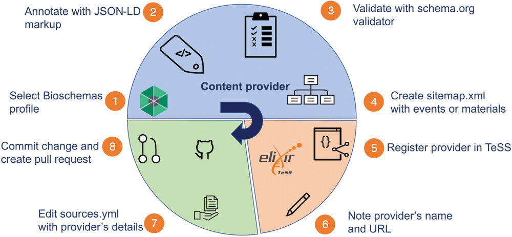
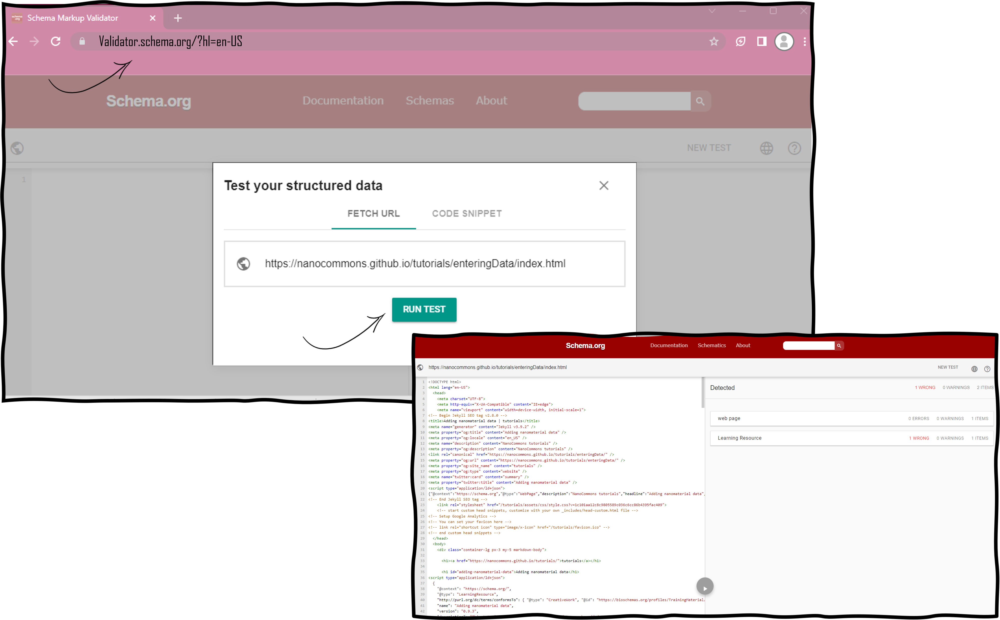

## Scenario 8: Automated harvesting of a training event in TeSS


Registering events and training materials makes them more findable in a variety ways to various user bases. TeSS features several options for automatically "harvesting" resources from external sources. This can be helpful if you are maintaining a large collection of events and materials that changes frequently. 


To register resources in TeSS automatically, we need to be able to extract data from target sources reliably. To this end, it is helpful if the data is structured according to a globally used standardized format. 

The following are examples of the kinds of structured data that TeSS can work with:

If your website currently includes no structured data, and you’d like your resources added to TeSS, we recommend using Bioschemas to structure your site. [Schema.org](https://schemas.org) is a project running by a consortium of search engines that has created an extensive library of schemas. Web-masters can use these schemas to explicitly mark-up their websites content in order to improve search engine visibility and interoperability. 

[Bioschemas](https://bioschemas.org) is an initiative to supplement the work of schema.org to help improve the findability of online resources in the life sciences. 

TeSS supports the following Bioschemas profiles: for events that are courses **CourseInstance** and **Course**, for other events **Event**, for training materials **TrainingMaterial**. Fig. 3 displays a schematic overview of the protocol steps.




1.	Select the profile [**Learning resource**](https://bioschemas.org/profiles/TrainingMaterial/1.0-RELEASE) for the automated harvesting of a specific training material. 
For training events, select **Course/CourseInstance** for training by using the profile described at https://bioschemas.org/profiles/CourseInstance.

In our example, the material is provided by the [NanoCommons initiative](https://nanocommons.github.io/user-handbook/) located [here](https://nanocommons.github.io/tutorials/enteringData/index.html).

2.	Manually annotate the HTML web site containing the training material with JSON-LD markup. 

In our example, we use **index.html**.In order to inspect this object, browse to the [index page](https://nanocommons.github.io/tutorials/enteringData/index.html) of the NanoCommons initiative.  More specifically, enter a JSON object as shown below in a script element with the attribute type="application/ld+json". This script element needs to be placed as a child of the head element of the HTML page. This results in the following script HTML element.

```json
 <script type="application/ld+json">
  {
	"@context": "https://schema.org/",
	"@type": "LearningResource",
	"http://purl.org/dc/terms/conformsTo": { "@type": "CreativeWork", "@id": "https://bioschemas.org/profiles/TrainingMaterial/1.0-RELEASE" },
	"name": "Adding nanomaterial data",
	"version": "0.9.3",
	"description": "This tutorial describes how nanomaterial data can be added to an eNanoMapper server using a RDF format.",
	"license": "https://creativecommons.org/licenses/by/4.0/",
	"keywords": "ontologies, enanomapper, RDF",
	"url": "https://nanocommons.github.io/tutorials/enteringData/",
	"provider": {
  	"@type": "Organization",
  	"name": "NanoCommons",
  	"url": "https://www.nanocommons.eu/"
	},
	"audience": {
  	"@type": "EducationalAudience",
  	"educationalRole": "Graduates"
	},
	"inLanguage": {
  	"@type": "Language",
  	"name": "English",
  	"alternateName": "en"
	},
	"author": [
  	{
    	"@context": "https://schema.org",
    	"@type": "Person",
    	"name": "Egon Willighagen",
    	"identifier": "https://orcid.org/0000-0001-7542-0286",
    	"orcid": "https://orcid.org/0000-0001-7542-0286"
  	}
	]
  }
</script>
```
 
3.	Validate the individual page with the [schema.org validator](https://validator.schema.org) by pasting the URL into the Fetch URL tab. The validation procedure will indicate if you have used non-existing properties of the Bioschemas profile. If error messages are returned, have a look at the troubleshooting section below.

Example: https://nanocommons.github.io/tutorials/enteringData/index.html



4.	Create a sitemap listing the material page URL and save it as sitemap.xml. This sitemap.xml file needs to be publicly browsable on the internet. In our example, the manually created sitemap.xml is [published](https://nanocommons.github.io/sitemap.xml).
More complex mechanisms for sitemap creation are available by using content management systems like Drupal and using specific sitemap plugins.

5.	Register a Content Provider in TeSS  following the basic protocol 6. Use ‘NanoCommons’ as a provider.

6.	Make note of your Content Provider's exact Title and URL referring to the properties Title and URL mentioned in basic protocol 6. In our example, it is ‘NanoCommons’ as Title and ‘https://www.nanocommons.eu/’ as URL. 

7.	Go to https://github.com/ElixirTeSS/bioschemas_sources/edit/main/sources.yml to edit the sources.yml file and add your content provider details along with the URL to your sitemap, e.g.

  - title: NanoCommons
      url: https://www.nanocommons.eu/ 
      source: https://nanocommons.github.io/sitemap.xml
 
8.	Commit your change, click the button to open a pull request, which will then be reviewed. After review, the new training material will appear in TeSS. 
Your content should appear in TeSS the following day. Each source will be scraped once per day at ~3AM UTC.

*****************

## Curation of manual content for automatically harvested event or training materials 

In protocols [5](#protocol-5-manual-registration-of-a-training-event-in-tess) or [6](#protocol-6-manual-registration-of-training-material-in-tess) about manual provisioning of the information, it is important to note that much of the content in TeSS is retrieved and kept up-to-date via automated scrapers (see [protocol 8 Registering events/materials automatically](#protocol-8-automated-harvesting-of-a-training-event-in-tess)) that pull information from public web pages and APIs in regular intervals. To prevent TeSS from overwriting a field you have just changed, click the “locker” icon to lock the field. Fields marked as locked will not be overwritten by an automatic procedure.

For the training event and material, several mandatory fields have to be filled in, marked with the “*” symbol. There are also a number of optional fields. 

## Recommendations for automated harvesting of a training event in TeSS

`TODO: check on exercises`

In step 2 of [Protocol 8](#protocol-8-automated-harvesting-of-a-training-event-in-tess), we recommend to follow the guidelines from the BioSchemas community on strategies on how to markup your internet sites by using this tutorial https://bioschemas.org/tutorials/howto/howto_add_markup. If your website is hosted on github, you can follow https://bioschemas.org/tutorials/howto/howto_add_github instead.

In step 3, in the case that you get an error during the validation procedure by the validator from schema.org, consult the properties definitions in the respective profile on schema.org and bioschemas.org. 
In step 7, you need to have an account on github.com to edit the sources.yml file. It is important to make sure the title and url exactly match the Content Provider's title and URL on TeSS. You will make changes in the github project ElixirTeSS/bioschemas_sources, for which you don’t have write access to. Submitting a change will write it to a new branch in your fork <your github user name>/bioschemas_sources, so that you can send a pull request afterwards.
If you have implemented Bioschemas markup on your website and would like your content to appear in TeSS, see our "Bioschemas sources" repository for detailed information on how to proceed: https://github.com/ElixirTeSS/bioschemas_sources#readme

`TODO: add new feature on Provider page!`

## Troubleshooting

In case, you experience issues with missing concepts in the EDAM ontology, potentially new properties in the form on the TeSS website, a missing hosting institution or synchronizations issues with the automated procedure, please refer to entries in the table below for troubleshooting.

Sources and Solutions to Potential Errors

| Problem                                                                           | Possible Cause                                               | Solution                                                                                                            |
| :-------------------------------------------------------------------------------- | :----------------------------------------------------------- | :------------------------------------------------------------------------------------------------------------------ |
| Missing concept in the EDAM ontology.                                             | The EDAM ontology does not cover all scientific topics.      | Select a term which is closely related or submit a request to add new concepts in the EDAM ontology if appropriate. |
| There are new properties in the TeSS interface for events or material.            | Sometimes new properties are added to the interface in TeSS. | Browse to the documentation on the TeSS web site.                                                                   |
| Your host institution is missing when you are registering an event or a material. | The dropdown of the host institutions is a fixed list.       | Enter a new host organisation in the field.                                                                         |                                 
| By using the automated harvesting protocol, your training material does not appear in TeSS on the next day. | The title and/or URL did not exactly match the Content Provider's title and URL on TeSS  | Double check that the title and url exactly match the Content Provider's title and URL on TeSS.| 
| After using the automated harvesting protocol, your training material does not appear in TeSS the following day | You might have provided a validated Bioschemas markup but the harvesting procedure in TeSS did not recognise all the properties correctly.| Submit an issue on the ELIXIRTeSS/Bioschemas_sources github repository.                                                                                               |
